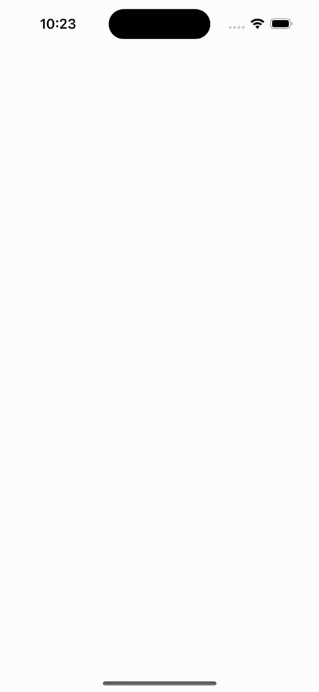

# VRUIKit

This library provdes reusable UI-components.

## Components

### Circles Renderer

Provides a simple configurable interface to draw circle-on-water-like animations 

### HorizontalSegmentedView

A simple view that allows you to present segmented views, e.g.: segmented progress bars, audio-playing views and so on.

**Black&White Thick Example**  

**Colored Thin Example**  

